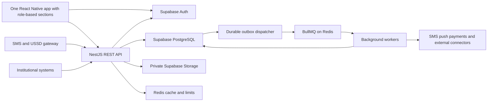

# AutoGuardian Backend Implementation Plan

Planning date: 4 October 2026. This document describes the proposed server implementation for one complete AutoGuardian product. It does not create services, accounts, provider integrations or application code.

## 1. Authority and scope

The product source is `AutoGuardian — Software Requirements Specification (EN).docx`, dated 2 October 2026. Its role matrix, F1–F11 flows and BR-01–BR-20 rules govern functionality. The user's later decisions select **one React Native mobile app with role-based sections**, English-first designs, Supabase storage/authentication and a single product plan without V1/V2/V3 delivery labels. Consumer, agent, institutional and administration capabilities share one mobile client and backend. French support, basic-phone channels and institutional APIs remain in scope. Separate mobile apps and desktop websites are outside the user's current delivery target; this is an explicit departure from the SRS's component/platform list that needs client reconciliation before contractual acceptance.

The document is planning evidence, not proof that the client has approved every requirement or cost. Confirm the complete functional scope before agreeing to a fixed delivery date or price. Retain dependency-gated features in the plan rather than inventing institutional access or dropping them. `/v1` is the required API version prefix, not a product-release label.

**Selected** decisions come from the user. **Proposed** technical choices and resolutions are recommendations. **Pending** decisions in section 11 must not be presented as approved client requirements.

## 2. Proposed architecture

Use a TypeScript NestJS modular monolith, with a separate worker process from the same repository. This is proposed, not yet selected by the user. It keeps business rules in one place while allowing modules and workers to scale independently. Avoid starting with multiple independently deployed domain services.



Core business writes pass through the API. The mobile client does not directly update vehicles, ownership, sale status, payments, responses, tokens or role assignments in Supabase. It authenticates with Supabase and sends access tokens to the API. Shared sign-in does not weaken role-specific password/OTP, PIN or institutional-factor requirements. Domain data uses private schemas, a restricted runtime database role, database isolation policies and server-side authorization. See `supabase.md` for the access strategy and privileged-connection limits.

Use `pg` with typed repositories and reviewed SQL as the proposed data-access layer; Supabase SQL migrations are the schema authority. An ORM is optional and should not introduce a second competing migration history. Use a PostgreSQL transactional outbox for durable work; BullMQ/Redis is proposed dispatch infrastructure, not the sole record of deadlines or tasks.

The selected Supabase data store does not remove the need for a backend host, workers, SMS/USSD providers, payment providers, monitoring or object backups. Hosting remains subject to authority localization requirements.

## 3. Repository and module boundaries

Proposed repository layout:

```text
apps/
  mobile/
  api/
  worker/
packages/
  contracts/
  translations/
  mobile-ui/
  design-tokens/
supabase/
  migrations/
  tests/
  seed.sql
```

The single mobile workspace contains consumer, agent, institutional and administration feature modules, shared authentication/navigation and reusable native components. Server role assignments control access to each section; accounts with several roles can switch only between permitted contexts. No separate frontend deployment or installation is needed for these sections. Shared contracts contain safe request/response types, not raw database entities or secrets.

| Module | Responsibilities | Source |
| --- | --- | --- |
| Identity and access | Phone authentication integration, PIN verification, role/scope assignments, consent, sessions, phone change | 3, 4, F11, 13 |
| Authorities and configuration | Tenant identity, versioned settings/templates, organization management, regional rules | 5, 10, 15 |
| Agents and enrollment | Accreditation, encrypted-draft synchronization, identity proof, duplicate checks, review, suspension flags | F1, BR-11, BR-18 |
| Vehicles and ownership | VIN/plate history, exactly one active owner, sale states, transfers, authority movement | F5, F6, 7 |
| Seals | Signed identifiers, batches/stock, allocation, fitting/replacement/revocation, inspections, confidentiality | F7, 8 |
| Verifications | Quotas/payment gates, privacy-safe status lookup, per-buyer outcomes and expiry | F2, F3, BR-05–BR-10 |
| Alerts and channels | Grouped owner alerts, backup escalation, responses, localization, delivery receipts | F3, 10 |
| Missing reports and incidents | Immediate missing status, police references, reasoned lifting, anomaly processing | F4, F8 |
| Billing | Subscriptions/installments, payments/refunds, cash/remittance, shares/reconciliation, receipts | F10, 11 |
| Clearances and locks | Consent/checks, operation/org-bound single-use tokens, enforcement switches | F9, BR-15–BR-16 |
| Connectors and institutional API | Adapter contracts, REST/SOAP/import/webhook sources, technical accounts, partner events | 12 |
| Audit and reporting | Sensitive reads/writes, hash chaining, exports, scoped dashboards and aggregated statistics | 13, 15 |

## 4. Authentication and permissions

### Consumer identity

Use Supabase phone OTP for primary consumer login. Free-plan authentication does not include free delivery of real SMS: configure a supported provider or a verified Send SMS Hook to a regional provider. DRC delivery, latency, sender registration, cost and operator coverage require testing. Do not substitute email OTP for the required basic-phone workflow. [Phone sign-in](https://supabase.com/docs/guides/auth/phone-login), [Send SMS Hook](https://supabase.com/docs/guides/auth/auth-hooks/send-sms-hook).

Self-registration grants only verifier capability. Owner records are created through accredited enrollment; backup contacts and sellers gain their relationship-based permissions only after invitation acceptance. Institutional roles cannot be selected during public signup.

Owner PIN is a separate application credential, stored only as a salted adaptive hash in a private identity store. Apply attempt limits, lockout and expiring, action-bound step-up proof. Never put a PIN in a JWT, log, notification, URL or client-readable database field. Reset/recovery policy is pending. Validate PIN and current ownership server-side on sensitive actions.

### Professional and institutional access

Enforce the role-specific authentication table: professional password + OTP; agent password + OTP; other institutional roles require two factors; platform admins also require an IP allow-list. SRS section 13 states SMS OTP for everyone, while some role entries say only “2 factors”; the exact factor combinations need D04 resolution. TOTP is a possible lower-cost second factor where the client agrees, not an assumed replacement for the specified agent/password/SMS flow. Supabase phone MFA is distinct from primary phone OTP and is not included on the Free plan. [MFA documentation](https://supabase.com/docs/guides/auth/auth-mfa/phone), [Supabase pricing](https://supabase.com/pricing).

Treat institutional client credentials as separate technical accounts scoped to tenant, organization and mission. Supabase's documented OAuth server does not support `client_credentials`; select a maintained OAuth authorization-server solution supporting that grant or a reviewed implementation before building this integration. Never give partners Supabase service keys as API credentials. [Supported OAuth flows](https://supabase.com/docs/guides/auth/oauth-server/oauth-flows).

### Authorization on every request

Verify token issuer/signature/expiry, account/session state, tenant membership, role validity, organization scope, current ownership, insurer consent and the action's authentication strength. Do not rely only on potentially stale JWT role claims. Deny by default and use the exact SRS section 4 matrix as the policy source.

All fourteen codes are retained: `VERIFIER`, `OWNER`, `BACKUP_CONTACT`, `SELLER_AGENT`, `PRO_VERIFIER`, `ENROLLMENT_AGENT`, `ENROLLMENT_ORG_ADMIN`, `LAW_ENFORCEMENT`, `REGISTRY_OFFICER`, `INSURER`, `TENANT_ADMIN`, `SUPPORT`, `AUDITOR`, `PLATFORM_ADMIN`.

Support receives masked identity/history and cannot change vehicles. Auditors are read-only with the source's masking rules. Platform admins manage infrastructure and settings; personal-data access requires an explicit logged emergency procedure. Cross-authority access is limited to designated platform admins/auditors, not every account with those roles. Institutional identity lookups require a reason and an audit entry before disclosure.

Time-limited sessions, remote logout and failed-attempt lockout must be enforced even when a chosen Supabase tier does not provide all native session controls. Design application session revocation/freshness checks rather than promising features from a paid plan on Free. Switching into agent/institutional/admin sections requires the applicable authentication strength and current scope; hiding navigation alone is not a security boundary. Isolate local caches and encrypted agent evidence by account/authority/role context in the shared installation.

## 5. Domain workflows and transaction boundaries

### Enrollment F1

1. Check current agent accreditation, organization and authority permissions.
2. Accept draft metadata and attachments under a client-generated idempotency key. Offline drafts are provisional, not registered vehicles.
3. Normalize plate/VIN without assuming every DRC chassis number has a modern 17-character format. Confirm validation formats with the authority.
4. Check duplicates centrally. Concurrent duplicate submissions must be stopped by database constraints as well as validation. Commit a duplicate incident even if the enrollment is refused.
5. Verify owner phone possession by OTP; record identity/company evidence and versioned consent.
6. Validate package and four fitted seals for packages requiring seals; seal types/stock/assignment/photos must match.
7. Confirm provider payment or the separately configured cash collection policy. Do not equate an agent's unverified payment claim with provider settlement.
8. Create vehicle, owner relationship, seal placements, subscription, enrollment and audit records atomically after prerequisites. Use PENDING_REVIEW when second validation is required, otherwise ACTIVE; always NOT_FOR_SALE initially.
9. Queue welcome SMS and PIN setup instructions through the outbox. Never transmit a chosen PIN in welcome credentials.

External calls happen outside a long-lived database transaction. Persist their outcomes, then perform a short final transaction that rechecks prerequisites. Incomplete enrollment data must not be published as a protected vehicle.

### Verification and payment F2

Count usage by verified phone and the authority's configured period/time zone. Enforce daily cap, free allowance, role exemptions and professional credits atomically. Reserve/consume allowance once per idempotent check; define release policy for platform failures. Apply device/IP/phone rate limits in addition to billing quotas.

For a paid check, show only price/payment state before server-confirmed payment. After it is confirmed, perform authoritative lookup, return a privacy-safe status/trust/seal result and record an owner-alert outbox event for every registered vehicle, regardless of sale status. Unknown queries have no owner to notify. Their terminal representation is pending in D09.

Cache only safe lookups with version-based invalidation; never reuse a cached confirmation, clearance permission or owner identity. Missing reports and ownership changes must immediately invalidate stale status projections. Measure the under-three-second status target separately from user payment time and the owner's response delay.

### Owner response and escalation F3

Persist request creation, payment decision, owner-notification time, backup deadline, final response deadline and confirmation validity. Proposed defaults from the SRS are five minutes to backup, fifteen minutes to no response and twenty-four hours for a confirmed transaction. Snapshot configuration for the operation; later setting changes affect new operations only.

Group notifications within the proposed ten-minute window, but keep individual request IDs, recipients, deadlines and per-verifier confirmations. A YES cannot silently approve other buyers in the group. The exact grouping interaction and deadline anchor need D06 confirmation.

Response processing locks the request, checks current actor/delegation, PIN/step-up requirements and server deadline, then writes outcome/audit/outbox atomically. Concurrent replies, timeout workers and duplicated SMS callbacks must produce only one effective outcome. Late replies cannot resurrect timed-out or expired approvals.

NO creates an incident and offers the owner a missing report. Lack of response escalates to the accepted backup contact, then becomes NO_RESPONSE and is displayed as sale not confirmed. Transport failures do not count as a reply. Backup notification does not transfer ownership or seller rights. Positive delegated approval awaits D08 resolution.

Record notification attempts/retries and delivery receipts. Workers use persisted schedules and a recovery sweep to process overdue work after restarts. The under-ten-second owner-alert target should record both provider acceptance and delivery latency, with the exact acceptance metric agreed before release.

### Missing reports and sale status F4 F5

Missing reporting is immediate for authorized reporters; accept date/approximate time/comment, and optionally an official police reference. Distinguish the source/official status. Lift only with authorized actor and reason; see D10 for the tenant-admin matrix/flow discrepancy.

Owner sale-listing changes require PIN and a configured duration. Mandates are accepted by OTP, expire within the configured maximum and can be revoked by the owner. All expiry jobs are idempotent. Seller mandates do not grant alert approval.

Preserve the source's declared sale transitions:

| Current state | Allowed next state |
| --- | --- |
| NOT_FOR_SALE | FOR_SALE, AGENT_SALE, REPORTED_MISSING |
| FOR_SALE | NOT_FOR_SALE, REPORTED_MISSING |
| AGENT_SALE | NOT_FOR_SALE, REPORTED_MISSING |
| REPORTED_MISSING | NOT_FOR_SALE after an authorized lift with reason |

Do not invent direct FOR_SALE-to-AGENT_SALE transitions; reconcile the mandate flow with this table before implementing the UI interaction. Administrative record state and subscription state are separate from sale state. A listed or confirmed transaction must not override a missing report. The exact eligibility of a positive sale response on missing/blocked records is an unresolved policy in D09; propose refusing positive authorization until clarified.

### Ownership transfer F6

Require permitted initiator, active mandate if applicable, buyer OTP acceptance, agent/registry identity validation and final seller PIN confirmation. Where a lock applies, verify the operation-bound clearance. In one transaction, close the old ownership, create the new ownership, reset sale status to NOT_FOR_SALE, audit the change and invalidate former-owner permissions/sessions or projections. Keep history without exposing former-owner personal history to the new owner. Confirm mandate/backup relationship invalidation rules in D09 before coding.

### Seals F7 F8

Generate a short verification URL containing an opaque seal identifier and versioned HMAC signature; no owner or vehicle data in the QR. Keep the signing secret server-side. Manual identifiers remain available on basic phones. Validate stock/assignment and atomic placement uniqueness.

Revoke with reason before replacement; a revoked identifier remains queryable and cannot become ACTIVE again. Keep all seal types visually identical publicly. Alarm classification/position is restricted to the roles named in SRS section 8, including the platform administrator caveat in section 4.

Inspection returns matched counts 4/4 through 1/4, revoked or another vehicle. Another vehicle's seal creates a high-priority incident. Do not invent a compliance rule for incomplete reads, 0/4, package NONE or replacement history; these need D09 decisions. Copy suspicion uses declared identifiers/vehicle facts and time, not GPS tracking.

### Clearances and locks F9

Check active eligible record, not missing, subscription current, seal compliance when applicable, and owner consent for this operation. Issue a cryptographically random token, store only its hash and bind it to authority, vehicle, operation, requesting organization and expiry. A report QR must disclose only an approved authenticity response, not a full private record or a freely usable bearer token.

Consume atomically with organization/operation/expiry checks and `used_at IS NULL`. Recheck disqualifying changes such as missing status; define token invalidation and retry semantics in D09. Return consistent results for an authorized retry of the same idempotent consumption request while blocking a second distinct operation. Locks default to disabled until configured and institutional agreements are in place.

### Billing and subscriptions F10

Mobile money is required: M-Pesa, Orange Money and Airtel Money through a selected local aggregator. Card acceptance uses a PCI-DSS provider's hosted/tokenized flow; AutoGuardian stores no card number/CVV. Prices, installments, free-use rules, taxes, invoice numbers and revenue splits are authority settings, with unresolved values left pending.

Use decimal/integer-minor-unit amounts, never floating-point money. Persist pricing/configuration snapshots, provider reference, webhook event IDs and reconciliation status. Validate callback signatures, replay windows and server-side amount/currency/purpose. Do not use a client redirect as proof of payment. Handle delayed success after a timeout without a duplicate charge or result.

Automatic refund applies to platform-side verification failure; other refunds require an authorized actor and reason. Allocate configured beneficiary shares transactionally; actual operator split/payout capability must be validated. A database revenue-share record is not proof that money reached a beneficiary.

Send localized receipts by SMS/email; provide bilingual generated receipts. Schedule configurable reminders with SRS defaults of 30, 7 and 1 day. After the configured grace period, suspend the relevant record/subscription eligibility for locks while retaining verification and owner alerts. Support cash only if enabled, recording organization collection and tracked remittance. Reconcile operator statements daily; discrepancies generate operational alerts.

### Account procedures F11

Phone change requires agent identity checks and new-number verification; invalidate old-number sessions and review active operations to prevent SIM-swap misuse. Operator SIM-change signals may be used if available, never assumed. Backup acceptance/removal/delegation, preferred language, channels, consent withdrawal, death/incapacity and rectification use reasoned, audited procedures.

## 6. API contract

Generate OpenAPI in English; stable machine error codes carry localized FR/EN messages. Use request IDs, pagination, input validation and idempotency keys for creation/payment/enrollment/synchronization/consumption actions. Public verification responses and institutional identity responses must be distinct projections.

Proposed application endpoint groups, whose precise routes are to be finalized from the contracts:

| Group | Operations |
| --- | --- |
| Account | Current account/roles, PIN setup/step-up, preferences, consent, agent-assisted phone change, session logout |
| Enrollment | Draft upload, attachment upload authorization, finalize, sync status, review |
| Vehicles | Owned list/detail, sale-status action, plate history where permitted |
| Verifications | Quote/start, payment state, status/result, authenticated progress stream |
| Alerts | Relevant request list, response and delegation checks |
| Missing | Report, official-reference update, authorized lift |
| Mandates and transfers | Invite/accept/revoke, start/accept/validate/complete |
| Seals | Stock/allocation, placement, replacement/revocation, inspection |
| Billing | Subscriptions/installments, payment initiation, receipts, refunds, statements/reconciliation |
| Administration | Organizations/agents/accounts, configuration/templates/connectors, audit, incidents, dashboards/exports |

Exact institutional endpoints from SRS section 12:

| Method and route | Authorized scope |
| --- | --- |
| GET `/v1/vehicles/lookup?vin=&plate=` | Police, registry, insurer technical accounts |
| POST `/v1/seal-checks` | Police, registry, insurer technical accounts |
| POST `/v1/clearances` | Registry and insurer technical accounts |
| GET `/v1/clearances/{id}` | Original requester |
| POST `/v1/clearances/{token}/consume` | Original requester and bound organization |
| GET `/v1/missing-reports?since=` | Police technical accounts |
| POST `/v1/missing-reports/{id}/police-reference` | Police technical accounts |
| POST `/v1/incidents` | Police and registry technical accounts |

Require OAuth client credentials, organization IP allow-list, per-organization quotas, mission scopes and identity-lookup reasons. Redact token paths from access logs. Signed partner webhooks cover missing report, other-vehicle seal and token consumption events; persist delivery IDs/retries and include only the subscribed organization's authorized data.

Use a backend authenticated progress stream or polling as the proposed realtime approach. Never subscribe buyers to raw vehicle/owner/payment tables. A disconnected client fetches current authoritative status on reconnection.

## 7. Offline synchronization

The SRS's fully offline app coexists with live OTP, duplicate and payment requirements. Proposed resolution: offline capture, online activation. Confirm this in D05 rather than promising fully offline final enrollment.

Store encrypted metadata and separately encrypted attachments, client IDs, schema version and local operation sequence. Keep a durable local outbox. On reconnection, reauthenticate as required, recheck agent scope/accreditation, upload attachments with checksums/retry, submit an idempotent draft, obtain required OTP/payment confirmation and finalize. A lost response must not create a second vehicle/payment/placement.

Server time controls audit acceptance and deadlines; record the device's claimed capture time separately. Reject suspended agents even if their device cached an earlier accreditation. Preserve refused/conflicting drafts for resolution without publishing them. Decide authenticated offline-session lifetime, lost-device handling and local retention before collecting real identities offline.

## 8. External connector contracts

Create adapters with explicit configuration validation, request mapping, authentication, timeout, retry/backoff, idempotency and health reporting. Separate adapter code from per-authority address, credential reference and sync frequency. Store secrets in a secret manager, not ordinary authority settings returned to administrators.

Cover SMS/USSD, mobile money, cards, push, WhatsApp and official registry/police/insurer sources. Registry sources may use REST/SOAP, CSV/XML import or webhooks. New sources need adapters without changing domain modules. Configuration alone cannot create an adapter for an arbitrary undocumented system.

DGI/police/insurer connectors start disabled and need agreements and actual API specifications. At enrollment, official match can prefill/validate authorized fields and promote trust level. An unavailable source gives “awaiting official confirmation,” queues a retry and does not invent government verification. Log necessary exchange metadata with redacted/minimized payloads. Official changes and theft reports require reconciliation rules, not blind overwrites.

## 9. Security audit and operational targets

Every write and sensitive identity/document read records actor, active role/scope, action, entity, reason, channel, server time and technical address. Technical IP is not GPS; it is protected audit metadata. Audit before disclosure and roll back disclosure authorization if auditing fails. Do not record OTPs, PINs, full credentials, bearer tokens or unrestricted identity images in logs.

Implement append-only hash chaining with serialized per-chain order and protected signing/checkpoint material. Export periodic chain checkpoints to a separately protected immutable store to detect database-level rewriting. Hashes stored in the same editable database alone cannot guarantee tamper-proof history. Minimize before/after payloads so retained audit records do not defeat personal-data retention rules.

TLS 1.2 minimum; encrypted database, backups and objects; separate personal/vehicle data; versioned consent; device/phone/IP rate limiting; misuse detection and scoped exports are requirements. Apply the source's public-web CAPTCHA requirement to any browser-accessible public verification entry that is separately approved; a desktop website is not in the current target. Native abuse prevention remains required. Obtain jurisdiction/hosting/retention decisions from qualified local advisers rather than asserting legal compliance from a cloud product selection.

| Required target | Validation approach |
| --- | --- |
| Verification availability at least 99.5% monthly | End-to-end uptime monitoring and incident accounting |
| Status under 3 seconds | Load test payment-complete/free lookup paths with source-defined scope |
| Owner alert under 10 seconds | Measure enqueue-to-provider-acceptance and delivery separately |
| Initial 100,000 vehicles and 20,000 checks/day | Synthetic volume plus bursts; 20,000/day is not peak concurrency |
| Several million vehicles, multiple countries | Tenant-aware indexes, archiving/partition feasibility, region strategy |
| Encrypted daily backups; monthly tests; recovery under 4 hours | Database/object/configuration restoration exercise |
| Android 8+, app under 30 MB, usable on 3G | Early native release-build/device spike and weak-network testing |

Expose health dashboards for API/workers/queues, SMS delivery, payment callbacks/reconciliation, connectors, backup age and audit integrity. Alerts must avoid leaking identities. Run independent penetration testing before launch and annually, as required by the SRS, with incident response and access-review procedures.

## 10. Implementation milestones and verification

1. **Resolve contracts:** approve D04–D09 security/workflow choices, model source enums, role matrix, provider contracts and configuration snapshots. Define FR/EN acceptance scenarios for every F1–F11 flow.
2. **Build foundation:** repository, local/staging environments, SQL migrations, identity/tenant access, audit/outbox, translations and observability. Prove RLS/runtime-role isolation and encrypted native offline feasibility.
3. **Complete core chain:** accredited enrollment → mobile-money/free verification → owner alert → reply/timeout → missing reporting; add stock, fitting and revocation. Verify replay/retry/duplicate behavior.
4. **Complete ownership/billing:** mandates, transfers, subscriptions/installments, shares/refunds/reconciliation, account procedures and back-office review/configuration.
5. **Complete institutional capabilities:** in-app institutional/admin sections, clearance/locks, OAuth technical accounts, consent-limited insurers, dashboards, connectors and partner webhooks. Activate each external service only after agreement/contract tests. Desktop/browser delivery needs a separate client scope decision.
6. **Prove release readiness:** real basic-phone SMS/USSD FR/EN flows, provider outage tests, entry-level device tests, load/availability evidence, backup restore, penetration-test closure, role guides and operations documentation.

Required meaningful tests include concurrent duplicate enrollment, seal reuse/revocation, one-active-owner enforcement, cross-tenant denial, masked identity projections, payment forgery/replays, late owner response versus timeout, grouped buyer isolation, token double-consumption, former-owner access after transfer, suspended-agent sync, lost network response replay and unpaid-subscription alerts remaining active. Verify real provider behavior before acceptance; mocks are development aids, not integration evidence.

Deliver the source repository owned by the project holder, one store-ready role-based app/publication when launch is authorized, English README/OpenAPI/installation/operations/connector guides, automated suites, and bilingual role guides. Android is first; any later iOS build is the same product on another platform, not a separate app by user role. Do not invent a delivery duration or claim store publication is authorized by this planning task.

## 11. Shared decision register

This register applies to all three plans. Pending values remain explicit; source defaults can be used for prototype/configuration seeds where marked, without being called final prices or client commitments.

| ID | Decision or inconsistency | Proposed treatment and required answer |
| --- | --- | --- |
| D01 | User explicitly wants one mobile app, while SRS specifies separate mobile apps/web portals; no release labels wanted | Use one mobile installation with role-based consumer/agent/institutional/admin sections and retain functional capabilities. Desktop websites are outside the current target. Reconcile this delivery-format departure and full scope with the client before budget/date/acceptance commitments. |
| D02 | One React Native client selected; server/tooling not expressly chosen | Propose Expo TypeScript development builds, NestJS API/workers and Supabase PostgreSQL/Auth/Storage. Do not scaffold separate consumer/agent/web clients. Validate size/device compatibility and secure role-based navigation/cache isolation early. |
| D03 | Client allows navy or violet; user's selection is ambiguous | Draft white/navy/yellow with proposed tokens; switch to violet if selected. English-first prototypes, bilingual runtime with authority default. |
| D04 | Free-tier OTP expectation and role MFA requirements | Plan Supabase phone login with separately budgeted SMS. Use test numbers only in development. Select provider and approved professional/institutional factor combinations; phone MFA may need a paid add-on. |
| D05 | Offline enrollment requires online OTP, duplicates, payment and accreditation checks | Propose encrypted offline drafts and online activation. Confirm offline-session validity, seal-stock conflicts and local retention. |
| D06 | Grouped alerts versus verifier-specific approvals; timer anchors unspecified | Propose notification grouping with individual approvals/deadlines, persisted server times and no auto-approval of a group. Confirm exact grouping UI and deadline start event. |
| D07 | SMS replies “1/2” versus PIN required for sensitive owner actions | Confirm secure SMS/USSD challenge, sender validation and request correlation. Do not trust sender number alone or include a reusable PIN in plaintext SMS. Ambiguous concurrent replies must not authorize a request. |
| D08 | “Only owner authorizes” versus backup response “if delegated” | Notification/reporting permissions remain scoped. Positive backup approval is disabled in the proposed interim policy until the owner/backup authorization rule is clarified. |
| D09 | Incomplete lifecycle and edge-case definitions | Confirm unknown/free check state paths, record status transitions, plate uniqueness geography, chassis normalization, mandate/listing transitions, 0/4/NONE seal compliance, missing/blocked approval, transfer relationship cleanup, and token invalidation after changes. Also resolve the basic-phone access principle versus the channel matrix's mobile/web/API-only clearance requests. Do not invent new source enums or silently add/remove channels. |
| D10 | Business configuration and matrix/flow discrepancies | Finalize seal/replacement prices, motorcycle/ketch/light-commercial plans, professional packages, splits, deadlines, review/cash policy and tax/numbering. The matrix permits tenant admins to lift reports; F4 and section 7 restrict lifting to owner/police. Clarify before enabling admin lifting. |
| D11 | External and legal dependencies | Choose SMS/USSD/mobile-money/card providers, USSD code, hosting/data locality, retention, pilot area, DGI/police/insurer agreements, connector APIs and required legal validation. No invented availability or legal conclusion. |
| D12 | Launch readiness and device timing | Use Free only as the intended development starting point, not a promise of free production. Budget API/workers/Redis, SMS, storage/backup and other providers. Confirm iOS launch timing and acceptance metric definitions; Android remains first. |

## 12. Traceability checklist

| Requirement group | Planned implementation |
| --- | --- |
| F1 and BR-01–BR-04/11/18 | Enrollment, uniqueness, ownership, owner-only status actions, suspension review |
| F2 F3 and BR-05–BR-10 | All-status alerts, refusal/timeout, per-buyer validity, privacy, grouping, caps |
| F4 F5 F6 F11 and BR-17 | Missing/lift, listing/mandates, transfer, agent-only phone change, account procedures |
| F7 F8 and BR-12–BR-14 | Seal uniqueness, inspection and other-vehicle incidents |
| F9 and BR-15–BR-16 | Expiring single-use clearances; missing vehicle refusal |
| F10 and BR-19 | Renewal/installments; nonpayment never disables resale alerts |
| BR-20 and SRS 13–15 | Auditing, access controls, monitoring, performance and dashboards |
| SRS 5, 10–12, 16–17 | Configuration, bilingual basic-phone channels, billing, APIs/connectors, deliverables and unresolved decisions |

Database implementation details are in `supabase.md`; design and Windows setup are in `frontend.md`.
